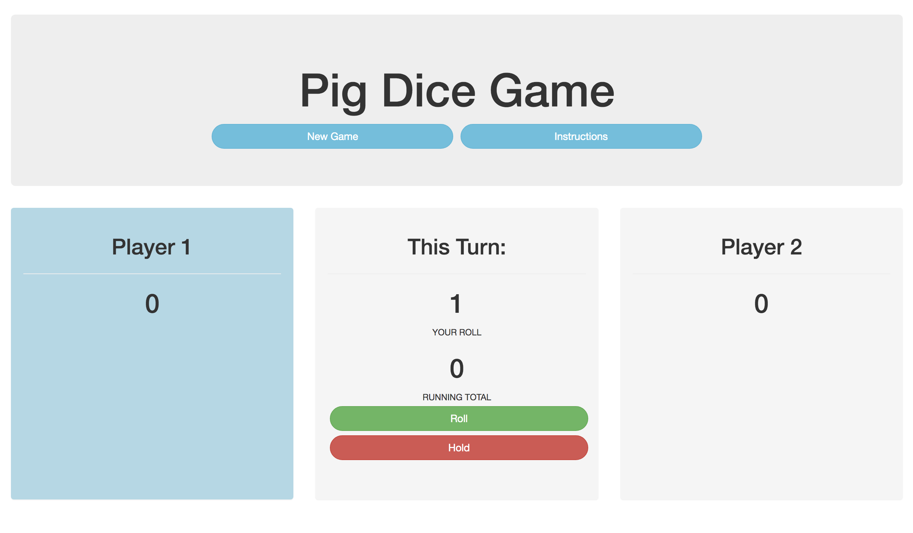

# _Pig Dice_

#### _A 2 Player Dice Game, Jan 2020_

#### By _**kwicz && Benjamin Thom**_


## Preview



**[View Live Preview](https://kwicz.github.io/pig-dice/)**

## Description

_{This is a detailed description of your application. Its purpose and usage.  Give as much detail as needed to explain what the application does, and any other information you want users or other developers to have. }_

## Project Specifications

| Behavior | Input | Output |
|---|:---:|:---:|
|User clicks "roll"|"roll"|1-6 returned|
|User recieves number|1|No score added|
|   |   |Next player's turn|
|   |2 - 6|Score tallied|
|User clicks "hold"|"hold"|Tallied score prints|
|   |   |Next player's turn|
|Tallied score reaches 100| |User with score 100 wins game|
|   |   |Game ends|
|   |   |Game resets|


## Setup/Installation Requirements

_In Terminal:_

* Navigate to where you want this application to be saved, i.e.:
```cd desktop```
* Clone the file from GitHub with HTTPS
```git clone https://github.com/kwicz/pig-dice.git```
* Open file in your preferred text editor
* On Mac: ```open -a {your text editor} pig-dice```
* On Windows: ```pig-dice```

_To Download Manually:_

* Navigate to https://github.com/kwicz/pig-dice.
* Click green "Clone or Download" button.
* Click "Download ZIP".
* Click downloaded file to unzip.
* Open folder called "pig-dice".
* Right click "index.html" and select your preferred browser or text editor.

## Known Bugs

_No known bugs at this time._

## Support and contact details

_Have a bug or an issue with this application? [Open a new issue](https://github.com/kwicz/pig-dice/issues) here on GitHub._

## Technologies Used

* Javascript
* jQuery
* HTML & CSS
* Bootstrap 3.3.7

### License

[MIT](https://choosealicense.com/licenses/mit/)

Copyright (c) 2020 **_Kwicz & Benjamin Thom_**