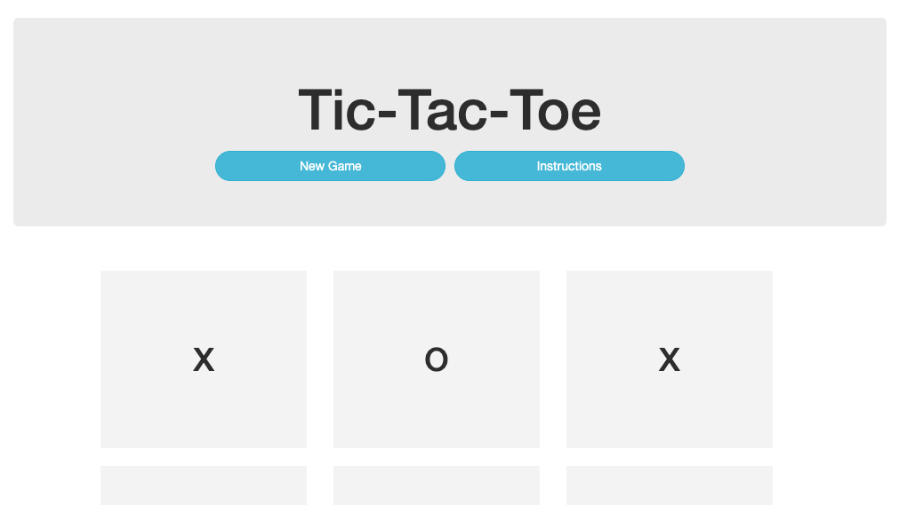

# _Tic Tac Toe_

#### _A 2 Player Board Game, Jan 2020_

#### By _**kwicz && Benjamin Thom**_


## Preview



**[View Live Preview](https://kwicz.github.io/tic-tac-toe)**

## Description

_This is an online recreation of the classic board game, Tic Tac Toe.  In this game, players must alternate selecting a box in a grid, filling it with either X or O, respectively.  The first player to fill 3 boxes in a row with an X or an O is the winner._

## Project Specifications

| Behavior | Input | Output |
|---|:---:|:---:|
|User hovers over a section of the board|cursor hover|highlight section|
|Player 1 selects spot on game board|click|X marks the spot|
|   |   |Next player's turn|
|Player 2 selects spot on game board|click|O marks the spot|
|   |   |Next player's turn|
|Player reaches 3 marks in a row|click|alert winnner|
|User restarts a game|click New Game button|Game resets|


## Setup/Installation Requirements

_In Terminal:_

* Navigate to where you want this application to be saved, i.e.:
```cd desktop```
* Clone the file from GitHub with HTTPS
```git clone https://github.com/kwicz/tic-tac-toe.git```
* Open file in your preferred text editor
* On Mac: ```open -a {your text editor} tic-tac-toe```
* On Windows: ```tic-tac-toe```

_To Download Manually:_

* Navigate to https://github.com/kwicz/tic-tac-toe.
* Click green "Clone or Download" button.
* Click "Download ZIP".
* Click downloaded file to unzip.
* Open folder called "tic-tac-toe".
* Right click "index.html" and select your preferred browser or text editor.

## Known Bugs

_No known bugs at this time._

## Support and contact details

_Have a bug or an issue with this application? [Open a new issue](https://github.com/kwicz/tic-tac-toe/issues) here on GitHub._

## Technologies Used

* Javascript
* jQuery
* HTML & CSS
* Bootstrap 3.3.7

### License

[MIT](https://choosealicense.com/licenses/mit/)

Copyright (c) 2020 **_Kwicz & Benjamin Thom_**